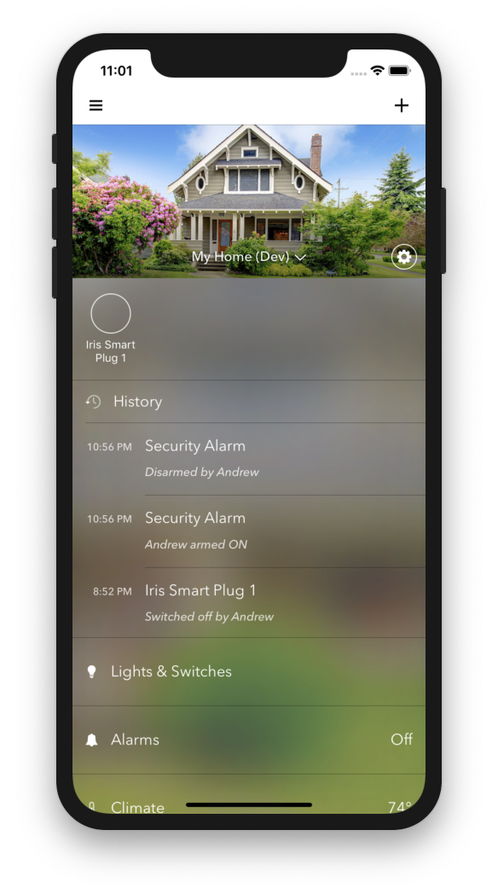
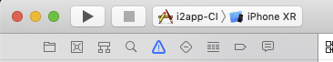

# Arcus iOS App

The Arcus iOS app is a Swift 3 / Objective C application that connects to the Arcus Platform. In order to use the iOS app, you will need to have access to a running instance of Arcus Platform.

# Quickstart

1. Download XCode 10.1: https://download.developer.apple.com/Developer_Tools/Xcode_10.1/Xcode_10.1.xip
2. Use XCode 10.1 to open the project
3. select "i2app-CI" from the build targets dropdown

4. Select an emulator with a modern version of iOS (10.0+)

